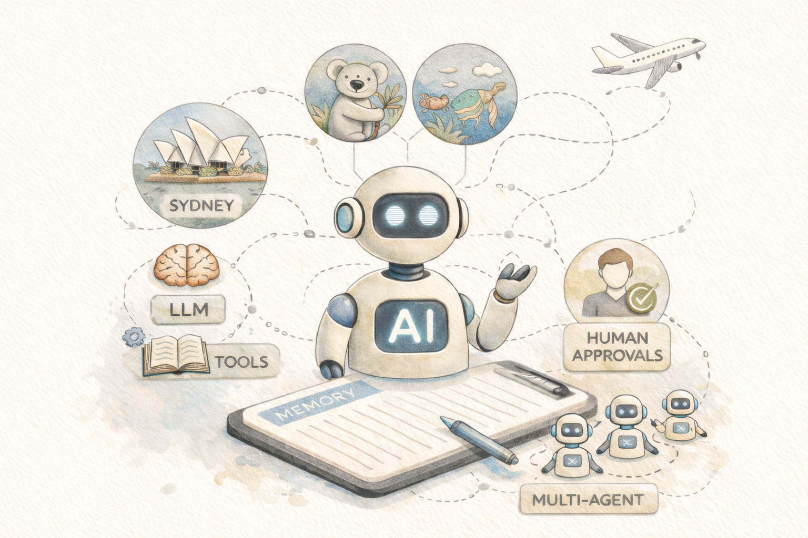

# Getting Started

Welcome to the AI Agent Builder Workshop!

In this hands-on workshop, you'll build **Travel Assistant**, an AI-powered agent that assists users plan trips, search flights, and provide personalized recommendations.

## What You'll Build

In this workshop, you'll build a complete AI-powered travel assistant agent through progressive hands-on labs. Use the navigation menu to access the labs in sequence.

## Technologies You'll Use

- **Microsoft Agent Framework** - SDK for building intelligent, context-aware agents with built-in support for orchestration, memory management, and tool integration.

- **Azure AI Foundry** - Used for accessing Azure OpenAI models for inference and generating embeddings.

- **Azure Cosmos DB** - NoSQL database service used for storing agent memory and application data.

- **.NET/C#** - Backend development of the agent's logic and API.

- **React** - Frontend development for the user interface.

- **OpenTelemetry** - A standard for observability, used for tracing and monitoring the agent's execution.

---

## Let's Get Started

Head over to the [Environment Setup](./00-setup_instructions.md) page for instructions on setting up your workshop environment.

Happy coding!
